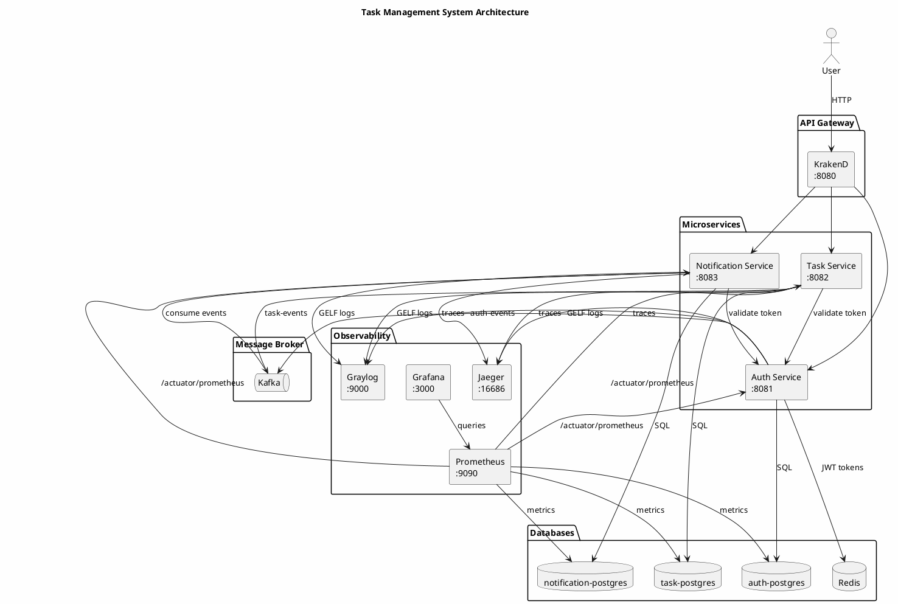

# Гайд по скриншотам

Пошаговая инструкция для получения каждого скриншота для отчета.

## Предварительные требования

Убедитесь, что система развернута и port-forwarding активен:

```bash
cd /Users/alexgribkov/study/virtualization-technologies/practical-work-8
./scripts/deploy-all.sh
./scripts/port-forward.sh
```

## Доступные сервисы

| Сервис | URL |
|--------|-----|
| Web Client | http://localhost:8084 |
| KrakenD API Gateway | http://localhost:8080 |
| Auth Service (напрямую) | http://localhost:8081 |
| Task Service (напрямую) | http://localhost:8082 |
| Notification Service (напрямую) | http://localhost:8083 |
| Graylog | http://localhost:9000 (admin/admin) |
| Grafana | http://localhost:3000 (admin/admin) |
| Prometheus | http://localhost:9090 |
| Jaeger | http://localhost:16686 |

**Важно:** Пароли должны быть минимум 8 символов!

---

## Скриншот 1: Архитектура системы

**Описание:** Диаграмма архитектуры системы Task Management

**Как получить:**
- Используйте PlantUML код ниже на https://www.plantuml.com/plantuml/uml или в IDE с PlantUML плагином
- Экспортируйте как PNG

**PlantUML код:**


---

## Скриншот 2: Поды PostgreSQL

**Описание:** Запущенные поды PostgreSQL в Kubernetes

**Команда:**
```bash
kubectl get pods -n task-management | grep postgres
```

**Ожидаемый вывод показывает:**
- auth-postgres-postgresql-0
- task-postgres-postgresql-0
- notification-postgres-postgresql-0

**Скриншот:** Вывод терминала со всеми 3 подами PostgreSQL в статусе Running

---

## Скриншот 3: Успешная авторизация

**Описание:** Успешный вход и ответ с JWT токеном

**Команды:**
```bash
# Сначала регистрируем пользователя (пароль минимум 8 символов!)
curl -s -X POST http://localhost:8081/api/auth/register \
  -H "Content-Type: application/json" \
  -d '{"username":"demo_user","email":"demo@example.com","password":"DemoPass123"}' | jq .

# Затем выполняем вход
curl -s -X POST http://localhost:8081/api/auth/login \
  -H "Content-Type: application/json" \
  -d '{"username":"demo_user","password":"DemoPass123"}' | jq .
```

**Или через KrakenD:**
```bash
curl -s -X POST http://localhost:8080/auth/register \
  -H "Content-Type: application/json" \
  -d '{"username":"demo_user","email":"demo@example.com","password":"DemoPass123"}' | jq .

curl -s -X POST http://localhost:8080/auth/login \
  -H "Content-Type: application/json" \
  -d '{"username":"demo_user","password":"DemoPass123"}' | jq .
```

**Скриншот:** Вывод терминала с JSON ответом, содержащим token, userId, username, expiresIn

---

## Скриншот 4: Создание задачи

**Описание:** Создание задачи через API

**Команды:**
```bash
# Сначала получаем токен
TOKEN=$(curl -s -X POST http://localhost:8081/api/auth/login \
  -H "Content-Type: application/json" \
  -d '{"username":"demo_user","password":"DemoPass123"}' | jq -r '.token')

# Создаем задачу
curl -s -X POST http://localhost:8082/api/tasks \
  -H "Authorization: Bearer $TOKEN" \
  -H "Content-Type: application/json" \
  -d '{"title":"Test Task","description":"Task for report screenshot","status":"PENDING"}' | jq .
```

**Скриншот:** Вывод терминала с JSON созданной задачи: id, title, description, status, userId, createdAt

---

## Скриншот 5: Kafka топики и события

**Описание:** Список топиков Kafka и сообщения

**Команды:**
```bash
# Список топиков
kubectl exec -it kafka-0 -n task-management -- \
  kafka-topics --list --bootstrap-server localhost:9092

# Просмотр сообщений в топике task-events
kubectl exec -it kafka-0 -n task-management -- \
  kafka-console-consumer --bootstrap-server localhost:9092 \
  --topic task-events --from-beginning --max-messages 5
```

**Скриншот:** Терминал с топиками (auth-events, task-events) и примерами событий

---

## Скриншот 6: Логи в Graylog

**Описание:** Логи HTTP запросов в Graylog

**Важно:** Если Graylog пустой, сначала создайте GELF UDP input:
```bash
curl -s -u admin:admin -X POST http://localhost:9000/api/system/inputs \
  -H "Content-Type: application/json" \
  -H "X-Requested-By: cli" \
  -d '{"title":"GELF UDP","type":"org.graylog2.inputs.gelf.udp.GELFUDPInput","global":true,"configuration":{"bind_address":"0.0.0.0","port":12201,"recv_buffer_size":262144}}'
```

**Шаги:**
1. Откройте http://localhost:9000
2. Войдите с логином admin/admin
3. Перейдите на страницу "Search"
4. Выполните несколько API запросов для генерации логов:
   ```bash
   TOKEN=$(curl -s -X POST http://localhost:8081/api/auth/login \
     -H "Content-Type: application/json" \
     -d '{"username":"demo_user","password":"DemoPass123"}' | jq -r '.token')

   curl http://localhost:8082/api/tasks -H "Authorization: Bearer $TOKEN"
   curl http://localhost:8083/api/notifications -H "Authorization: Bearer $TOKEN"
   ```
5. Найдите сообщения в Graylog
6. Кликните на запись лога для просмотра деталей (HTTP метод, URL, IP адрес)

**Скриншот:** Результаты поиска в Graylog с записями логов, показывающими HTTP метод, URL и IP адрес

---

## Скриншот 7: Prometheus Targets

**Описание:** Статус scrape targets в Prometheus

**Предварительно добавьте аннотации для Prometheus:**
```bash
kubectl annotate pods -n task-management -l app=auth-service \
  prometheus.io/scrape=true prometheus.io/port=8081 prometheus.io/path=/actuator/prometheus --overwrite

kubectl annotate pods -n task-management -l app=task-service \
  prometheus.io/scrape=true prometheus.io/port=8082 prometheus.io/path=/actuator/prometheus --overwrite

kubectl annotate pods -n task-management -l app=notification-service \
  prometheus.io/scrape=true prometheus.io/port=8083 prometheus.io/path=/actuator/prometheus --overwrite
```

**Шаги:**
1. Откройте http://localhost:9090
2. Перейдите в Status -> Targets
3. Проверьте, что все targets имеют статус UP:
   - auth-service pods
   - task-service pods
   - notification-service pods

**Скриншот:** Страница targets в Prometheus со всеми сервисами в статусе "UP"

---

## Скриншот 8: Grafana Dashboard

**Описание:** Дашборд Grafana с метриками сервисов

**Шаги:**
1. Откройте http://localhost:3000
2. Войдите с логином admin/admin
3. Перейдите в Dashboards
4. Откройте "Microservices Overview"
5. Дашборд содержит:
   - Services Health Status (UP/DOWN)
   - Process CPU Usage
   - JVM Heap Memory Used
   - JVM Threads
   - Database Connection Pool
   - Service Uptime

**Скриншот:** Дашборд Grafana с графиками метрик

---

## Скриншот 9: Трейс в Jaeger

**Описание:** Распределенный трейс запроса

**Шаги:**
1. Сгенерируйте трейс, выполнив API запрос:
   ```bash
   TOKEN=$(curl -s -X POST http://localhost:8081/api/auth/login \
     -H "Content-Type: application/json" \
     -d '{"username":"demo_user","password":"DemoPass123"}' | jq -r '.token')

   curl -X POST http://localhost:8082/api/tasks \
     -H "Authorization: Bearer $TOKEN" \
     -H "Content-Type: application/json" \
     -d '{"title":"Traced Task","description":"For Jaeger","status":"PENDING"}'
   ```
2. Откройте http://localhost:16686
3. Выберите сервис: "auth-service" или "task-service"
4. Нажмите "Find Traces"
5. Кликните на трейс для просмотра таймлайна

**Скриншот:** Просмотр трейса в Jaeger со спанами

---

## Скриншот 10: Persistent Volume - данные сохраняются после рестарта

**Описание:** Демонстрация сохранения данных после удаления пода

**Команды:**
```bash
# Шаг 1: Создаем пользователя
curl -s -X POST http://localhost:8081/api/auth/register \
  -H "Content-Type: application/json" \
  -d '{"username":"pv_test_user","email":"pv@test.com","password":"TestPass123"}' | jq .

# Шаг 2: Проверяем, что пользователь существует (вход работает)
curl -s -X POST http://localhost:8081/api/auth/login \
  -H "Content-Type: application/json" \
  -d '{"username":"pv_test_user","password":"TestPass123"}' | jq .

# Шаг 3: Удаляем под PostgreSQL
kubectl delete pod auth-postgres-postgresql-0 -n task-management

# Шаг 4: Ждем перезапуска пода
kubectl wait --for=condition=Ready pod/auth-postgres-postgresql-0 \
  -n task-management --timeout=120s

# Шаг 5: Проверяем, что пользователь все еще существует (вход работает)
curl -s -X POST http://localhost:8081/api/auth/login \
  -H "Content-Type: application/json" \
  -d '{"username":"pv_test_user","password":"TestPass123"}' | jq .
```

**Скриншот:** Терминал, показывающий:
1. Успешное создание пользователя
2. Удаление пода
3. Под снова готов
4. Успешный вход после рестарта (доказывает сохранение данных)

---

## Скрипт для генерации тестовых данных

Запустите этот скрипт для генерации тестовых данных для скриншотов:

```bash
#!/bin/bash

echo "=== Генерация тестовых данных для скриншотов ==="

# Регистрация пользователя
echo -e "\n--- Регистрация пользователя ---"
curl -s -X POST http://localhost:8081/api/auth/register \
  -H "Content-Type: application/json" \
  -d '{"username":"screenshot_user","email":"screenshot@test.com","password":"ScreenPass123"}' | jq .

# Вход и получение токена
echo -e "\n--- Вход в систему ---"
RESPONSE=$(curl -s -X POST http://localhost:8081/api/auth/login \
  -H "Content-Type: application/json" \
  -d '{"username":"screenshot_user","password":"ScreenPass123"}')
echo $RESPONSE | jq .
TOKEN=$(echo $RESPONSE | jq -r '.token')

# Создание задач
echo -e "\n--- Создание задач ---"
for i in 1 2 3; do
  curl -s -X POST http://localhost:8082/api/tasks \
    -H "Authorization: Bearer $TOKEN" \
    -H "Content-Type: application/json" \
    -d "{\"title\":\"Задача $i\",\"description\":\"Описание задачи $i\",\"status\":\"PENDING\"}" | jq .
done

# Получение задач
echo -e "\n--- Получение всех задач ---"
curl -s http://localhost:8082/api/tasks \
  -H "Authorization: Bearer $TOKEN" | jq .

# Получение уведомлений
echo -e "\n--- Получение уведомлений ---"
curl -s http://localhost:8083/api/notifications \
  -H "Authorization: Bearer $TOKEN" | jq .

echo -e "\n=== Готово! Теперь сделайте скриншоты из: ==="
echo "- Graylog: http://localhost:9000"
echo "- Grafana: http://localhost:3000"
echo "- Prometheus: http://localhost:9090"
echo "- Jaeger: http://localhost:16686"
```

---

## Соглашение об именовании скриншотов

Сохраняйте скриншоты в `report/screenshots/` с такими именами:

1. `01-architecture.png` - Диаграмма архитектуры системы
2. `02-postgres-pods.png` - Поды PostgreSQL
3. `03-auth-login.png` - Ответ авторизации
4. `04-task-create.png` - Создание задачи
5. `05-kafka-events.png` - Топики и сообщения Kafka
6. `06-graylog-logs.png` - Записи логов в Graylog
7. `07-prometheus-targets.png` - Targets в Prometheus
8. `08-grafana-dashboard.png` - Метрики в Grafana
9. `09-jaeger-trace.png` - Распределенный трейс в Jaeger
10. `10-persistent-volume.png` - Тест сохранения данных в PV
